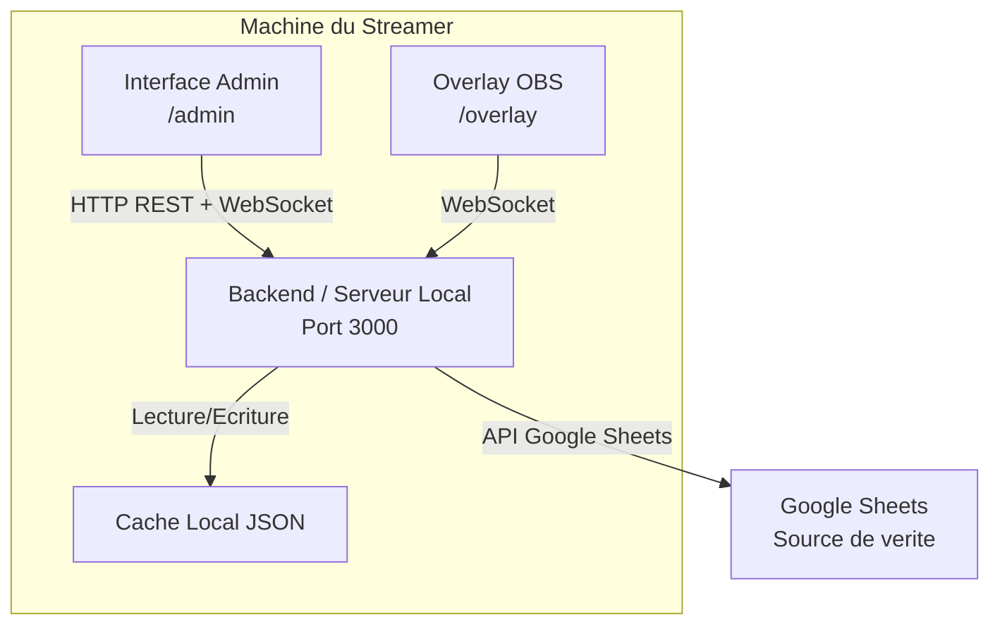
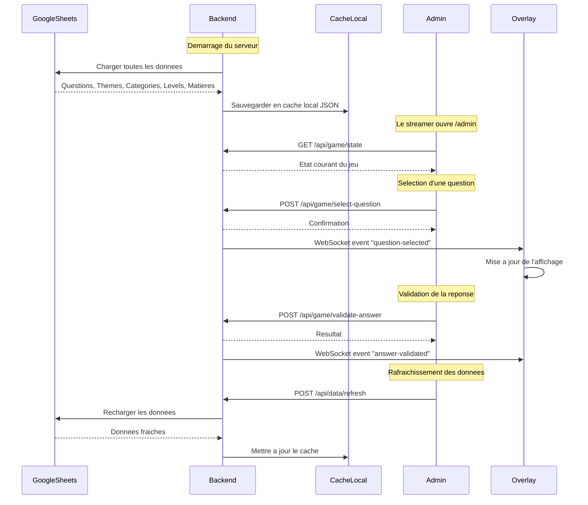
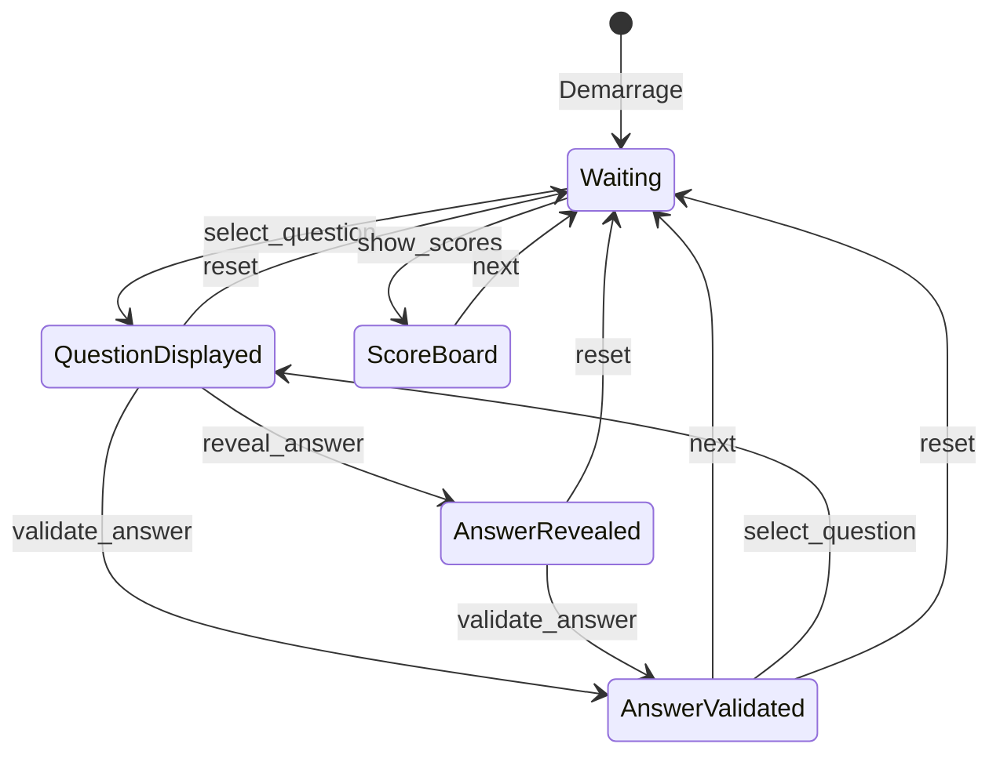
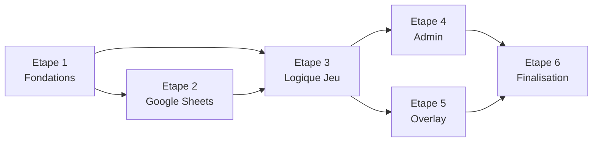
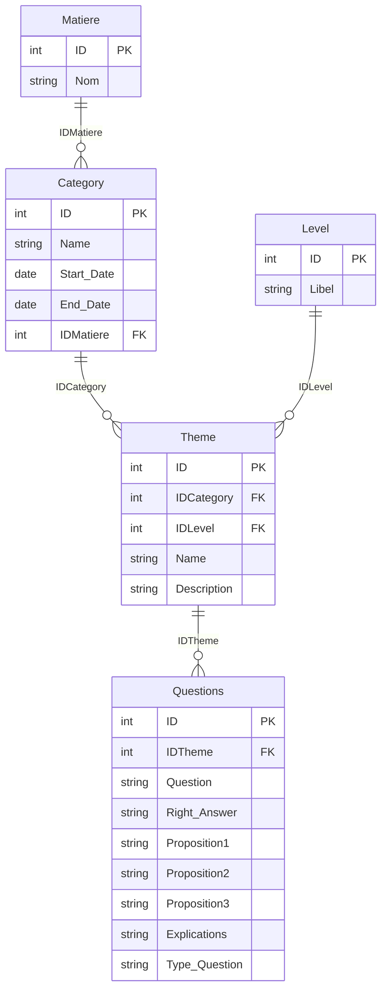

# Plan Complet du Projet -- Overlay Interactif OBS "Qui veut passer pour un teube"

---

## 1) Plan d'Architecture Generale

### 1.1 Description globale

Le systeme fonctionne **entierement en local** sur la machine du streamer. Il est compose de trois modules communicant via un serveur local unique :




### 1.2 Relations entre les trois modules

- **Backend (Serveur Local)** : Point central. Il expose l'API REST, sert les fichiers statiques (admin + overlay), gere la logique metier du jeu, et maintient la connexion WebSocket pour la synchronisation temps reel.
- **Interface Admin** : Application web front-end servie par le backend. Elle consomme l'API REST pour les actions (selectionner question, valider reponse, avancer, reset) et ecoute le WebSocket pour maintenir l'etat en synchronisation.
- **Overlay** : Page web front-end servie par le backend, affichee dans le navigateur integre d'OBS. Elle ne fait **aucune action** -- elle ecoute uniquement le WebSocket pour recevoir les mises a jour d'affichage.

### 1.3 Flux de donnees




### 1.4 Interaction avec Google Sheets

- Google Sheets est la **source de verite** pour les donnees de contenu (questions, themes, categories, matieres, niveaux).
- L'acces se fait via l'**API Google Sheets v4** avec un **compte de service**.
- Les donnees sont chargees au demarrage, puis disponibles via un **rafraichissement manuel** depuis l'admin.
- Un **cache local** (fichier JSON) permet le fonctionnement hors-ligne.

### 1.5 Contraintes techniques

- Fonctionnement 100% local (sauf appel Google Sheets)
- Compatible Windows (prioritaire)
- Leger en ressources (un seul processus serveur)
- Stable pour la duree d'un live (plusieurs heures)
- Compatible avec le navigateur integre d'OBS (Chromium embarque, pas de fonctionnalites avancees)
- Lancement via script BAT simple

---

## 2) Plan Technique Detaille

### 2.1 Technologies (categories)


| Categorie                | Role                                               | Suggestion technique                          |
| ------------------------ | -------------------------------------------------- | --------------------------------------------- |
| Serveur local            | Heberger le backend, servir les fichiers statiques | Node.js + Express                             |
| Interface web (Admin)    | Controler le jeu                                   | HTML/CSS/JS (vanilla ou framework leger)      |
| Interface web (Overlay)  | Afficher le jeu dans OBS                           | HTML/CSS/JS (vanilla, optimise OBS)           |
| Communication temps reel | Synchroniser admin <-> overlay                     | WebSocket (via Socket.IO ou ws)               |
| Acces Google Sheets      | Lire les donnees                                   | googleapis (google-spreadsheet ou googleapis) |
| Cache local              | Fonctionnement hors-ligne                          | Fichier JSON sur disque                       |


### 2.2 Structure des fichiers et dossiers

```
Interface OBS Jeu/
├── docs/                          # Documentation & specs (existant)
│   ├── CDC.txt
│   └── *.csv
├── server/                        # Backend Node.js
│   ├── package.json
│   ├── index.js                   # Point d'entree du serveur
│   ├── config.js                  # Configuration (port, IDs Google Sheets)
│   ├── routes/
│   │   ├── api-data.js            # Endpoints donnees (questions, themes...)
│   │   └── api-game.js            # Endpoints logique du jeu
│   ├── services/
│   │   ├── google-sheets.js       # Service d'acces a Google Sheets
│   │   ├── cache.js               # Service de cache local JSON
│   │   └── game-engine.js         # Logique metier du jeu (etats, transitions)
│   ├── websocket/
│   │   └── socket-manager.js      # Gestion des connexions WebSocket
│   ├── credentials/
│   │   └── .gitkeep               # Dossier pour le fichier service-account.json
│   └── cache/
│       └── data-cache.json        # Cache local des donnees Google Sheets
├── admin/                         # Interface d'administration
│   ├── index.html
│   ├── style.css
│   └── admin.js
├── overlay/                       # Overlay pour OBS
│   ├── index.html
│   ├── style.css
│   ├── overlay.js
│   └── assets/                    # Images, polices, sons
│       └── ...
├── .env                           # Variables d'environnement
├── .env.example                   # Template des variables
├── start.bat                      # Script de lancement Windows
└── README.md                      # Documentation utilisateur
```

### 2.3 Description des endpoints API

**Donnees (prefixe `/api/data`)**

- `GET /api/data/questions` -- Retourne toutes les questions (avec filtrage optionnel par theme, niveau, categorie)
- `GET /api/data/questions/:id` -- Retourne une question par ID
- `GET /api/data/themes` -- Retourne tous les themes
- `GET /api/data/categories` -- Retourne toutes les categories
- `GET /api/data/levels` -- Retourne tous les niveaux
- `GET /api/data/matieres` -- Retourne toutes les matieres
- `POST /api/data/refresh` -- Force le rechargement depuis Google Sheets
- `GET /api/data/status` -- Retourne l'etat de la connexion Google Sheets et la date du dernier chargement

**Jeu (prefixe `/api/game`)**

- `GET /api/game/state` -- Retourne l'etat complet du jeu en cours
- `POST /api/game/select-question` -- Selectionne la question a afficher `{ questionId }`
- `POST /api/game/reveal-answer` -- Revele la bonne reponse
- `POST /api/game/validate-answer` -- Valide une reponse `{ propositionIndex }`
- `POST /api/game/update-score` -- Met a jour le score `{ playerName, delta }`
- `POST /api/game/reset` -- Reinitialise le jeu
- `POST /api/game/next` -- Passe a l'etape/ecran suivant
- `POST /api/game/set-screen` -- Change l'ecran affiche `{ screen: "waiting" | "question" | "answer" | "scores" }`

**Fichiers statiques**

- `/admin` -- Sert `admin/index.html`
- `/overlay` -- Sert `overlay/index.html`

### 2.4 Mecanismes de synchronisation temps reel

**Evenements WebSocket (Serveur -> Clients)**

- `game:state-update` -- Diffuse l'etat complet du jeu (envoye apres chaque action)
- `game:question-selected` -- Une question a ete selectionnee
- `game:answer-revealed` -- La reponse a ete revelee
- `game:answer-validated` -- Une reponse a ete validee (correcte/incorrecte)
- `game:score-updated` -- Le score a change
- `game:screen-changed` -- L'ecran affiche a change
- `game:reset` -- Le jeu a ete reinitialise
- `data:refreshed` -- Les donnees ont ete rechargees depuis Google Sheets

**Evenements WebSocket (Client -> Serveur)**

- `connection` -- Connexion initiale (le serveur envoie l'etat courant)
- `request:state` -- Demande de l'etat courant (pour resynchronisation)

**Mecanisme de fiabilite**

- Reconnexion automatique WebSocket (cote client) avec backoff exponentiel
- A chaque reconnexion, le client demande l'etat complet
- Le serveur maintient l'etat en memoire (single source of truth cote serveur)

### 2.5 Gestion des erreurs et des etats

**Etats du jeu (machine a etats)**




**Gestion des erreurs**

- **Google Sheets inaccessible** : Log de l'erreur, utilisation du cache local, notification dans l'admin
- **WebSocket deconnecte** : Reconnexion automatique, indicateur visuel dans l'admin et l'overlay
- **Action invalide** : Reponse HTTP 400 avec message d'erreur explicite
- **Question introuvable** : Reponse HTTP 404, l'etat du jeu ne change pas

### 2.6 Gestion du cache local

- Au demarrage, le serveur tente de charger depuis Google Sheets
- En cas de succes : les donnees sont ecrites dans `server/cache/data-cache.json`
- En cas d'echec : le serveur charge `data-cache.json` s'il existe
- Le fichier de cache contient : les 5 tables + un timestamp du dernier chargement
- L'admin affiche la date du dernier chargement et un indicateur d'etat (en ligne / cache)

---

## 3) Plan de Developpement

### 3.1 Decoupage en etapes

#### Etape 1 -- Fondations (MVP minimal)

**Objectif** : Serveur qui demarre, sert les pages, et communique en temps reel.

- Initialiser le projet Node.js (`package.json`, dependances)
- Creer le serveur Express avec service de fichiers statiques
- Implementer le WebSocket (Socket.IO)
- Creer les pages HTML de base (admin + overlay)
- Implementer la machine a etats du jeu en memoire (avec donnees en dur)
- Tester : admin clique -> overlay se met a jour

**Livrable** : Un systeme fonctionnel avec des donnees en dur, synchronise en temps reel.

#### Etape 2 -- Integration Google Sheets

**Objectif** : Charger les vraies donnees depuis Google Sheets.

- Configurer le compte de service Google
- Implementer le service `google-sheets.js` (lecture des 5 onglets)
- Implementer le service `cache.js` (ecriture/lecture du cache JSON)
- Creer les endpoints `/api/data/*`
- Implementer le rafraichissement manuel depuis l'admin
- Tester : donnees chargees correctement, cache fonctionne hors-ligne

**Livrable** : Le backend charge les vraies questions depuis Google Sheets avec cache local.

#### Etape 3 -- Logique complete du jeu

**Objectif** : Toutes les fonctionnalites de jeu operationnelles.

- Implementer tous les endpoints `/api/game/*`
- Gestion complete des etats (machine a etats)
- Gestion des scores
- Filtrage des questions (par theme, niveau, categorie)
- Selection aleatoire de questions
- Historique des questions posees (pour eviter les doublons)

**Livrable** : Le jeu complet est jouable via l'admin avec toutes les transitions.

#### Etape 4 -- Interface Admin complete

**Objectif** : Interface utilisable et intuitive pour le streamer.

- Dashboard avec etat du jeu, connexion Google Sheets, nombre de questions
- Selection de question (filtres par theme/categorie/niveau)
- Boutons d'action (reveler, valider, suivant, reset)
- Affichage des scores
- Indicateurs de connexion (WebSocket, Google Sheets)
- Design responsive et ergonomique

**Livrable** : L'admin est pret pour une utilisation en conditions reelles.

#### Etape 5 -- Overlay OBS

**Objectif** : Overlay visuellement abouti et compatible OBS.

- Design de l'overlay (fond transparent, animations CSS)
- Affichage des questions avec les 4 propositions
- Animation de la revelation de la reponse
- Ecran des scores
- Ecran d'attente
- Transitions fluides entre les ecrans
- Tests dans OBS Studio

**Livrable** : L'overlay est pret pour le streaming.

#### Etape 6 -- Finalisation et packaging

**Objectif** : Le systeme est livrable et utilisable par le streamer.

- Script `start.bat` pour lancer le serveur
- Fichier `.env.example` avec documentation
- `README.md` avec instructions completes
- Tests de stabilite (simulation d'un live de 2h+)
- Gestion des erreurs edge-case

**Livrable** : Systeme complet, documente, pret a l'emploi.

### 3.2 Priorites (MVP -> version complete)

1. **MVP** (Etapes 1-2) : Serveur + WebSocket + Google Sheets + cache = le socle technique fonctionne
2. **Jouable** (Etape 3) : La logique du jeu est complete
3. **Utilisable** (Etapes 4-5) : Les interfaces sont pretes
4. **Livrable** (Etape 6) : Documentation, packaging, tests de stabilite

### 3.3 Dependances entre les taches




- Les etapes 4 et 5 peuvent etre developpees **en parallele** une fois l'etape 3 terminee.

### 3.4 Tests a prevoir

- **Backend** : Tests unitaires du game-engine (transitions d'etats), tests du service Google Sheets (mock), tests des endpoints API
- **WebSocket** : Test de connexion/deconnexion/reconnexion, test de diffusion d'evenements
- **Admin** : Tests manuels des actions (selection, validation, reset), test de l'indicateur de connexion
- **Overlay** : Tests dans OBS (affichage correct, fond transparent, animations), test de reconnexion WebSocket
- **Integration** : Test complet d'un parcours de jeu (demarrage -> questions -> scores -> reset)
- **Stabilite** : Test d'endurance (2h+ de fonctionnement continu)
- **Hors-ligne** : Test du fonctionnement avec cache uniquement (Google Sheets inaccessible)

---

## 4) Plan d'Integration Google Sheets

### 4.1 Comment charger les donnees

1. Au demarrage du serveur, le service `google-sheets.js` s'authentifie via le compte de service
2. Il lit les 5 onglets du spreadsheet en une seule operation (batch)
3. Les donnees brutes sont parsees et structurees en objets JavaScript
4. Les relations sont resolues (Theme -> Category -> Matiere, Theme -> Level, Question -> Theme)
5. Les donnees structurees sont stockees en memoire dans le backend
6. Une copie est ecrite dans le cache local (`data-cache.json`)

### 4.2 Structure des donnees dans Google Sheets

Le spreadsheet contient **5 onglets** :

**Onglet "Questions"**


| Colonne       | Type   | Description                             |
| ------------- | ------ | --------------------------------------- |
| ID            | Entier | Identifiant unique de la question       |
| IDTheme       | Entier | Cle etrangere vers Theme                |
| Question      | Texte  | Enonce de la question                   |
| Right_Answer  | Texte  | La bonne reponse                        |
| Proposition1  | Texte  | Proposition de reponse 1                |
| Proposition2  | Texte  | Proposition de reponse 2                |
| Proposition3  | Texte  | Proposition de reponse 3                |
| Explications  | Texte  | Explication apres la reponse            |
| Type_Question | Texte  | Type de question (QCM, vrai/faux, etc.) |


**Onglet "Theme"**


| Colonne     | Type   | Description                 |
| ----------- | ------ | --------------------------- |
| ID          | Entier | Identifiant unique          |
| IDCategory  | Entier | Cle etrangere vers Category |
| IDLevel     | Entier | Cle etrangere vers Level    |
| Name        | Texte  | Nom du theme                |
| Description | Texte  | Description du theme        |


**Onglet "Category"**


| Colonne    | Type   | Description                |
| ---------- | ------ | -------------------------- |
| ID         | Entier | Identifiant unique         |
| Name       | Texte  | Nom de la categorie        |
| Start_Date | Date   | Date de debut              |
| End_Date   | Date   | Date de fin                |
| IDMatiere  | Entier | Cle etrangere vers Matiere |


**Onglet "Level"**


| Colonne | Type   | Description                                      |
| ------- | ------ | ------------------------------------------------ |
| ID      | Entier | Identifiant unique                               |
| Libel   | Texte  | Libelle du niveau (ex: Facile, Moyen, Difficile) |


**Onglet "Matiere"**


| Colonne | Type   | Description        |
| ------- | ------ | ------------------ |
| ID      | Entier | Identifiant unique |
| Nom     | Texte  | Nom de la matiere  |


**Relations entre les tables**




### 4.3 Gestion des credentials

- Le fichier de credentials du compte de service (`service-account.json`) est place dans `server/credentials/`
- Ce dossier est ajoute au `.gitignore`
- L'ID du spreadsheet et le chemin vers les credentials sont configures dans `.env` :

```
GOOGLE_SHEETS_ID=<id_du_spreadsheet>
GOOGLE_SERVICE_ACCOUNT_PATH=./server/credentials/service-account.json
PORT=3000
```

- Un fichier `.env.example` documente les variables necessaires

### 4.4 Synchronisation avec le backend

- **Au demarrage** : chargement automatique depuis Google Sheets, fallback sur le cache
- **Rafraichissement manuel** : l'admin appelle `POST /api/data/refresh`, le backend recharge depuis Google Sheets
- **Pas de synchronisation automatique periodique** (pour ne pas surcharger l'API Google, ni perturber un jeu en cours)
- Le backend ne modifie **jamais** les donnees dans Google Sheets (lecture seule)

### 4.5 Gestion des erreurs Google Sheets

- **Credentials invalides** : Message d'erreur au demarrage, le serveur demarre quand meme avec le cache
- **Spreadsheet introuvable** : Idem, log d'erreur + utilisation du cache
- **Quota API depasse** : Log d'avertissement, utilisation du cache
- **Timeout reseau** : Timeout configurable (par defaut 10 secondes), fallback sur le cache
- **Donnees malformees** : Validation des donnees a la lecture, rejet des lignes invalides avec log d'avertissement
- L'admin affiche toujours un indicateur clair de l'etat de la connexion Google Sheets

---

## 5) Plan d'Utilisation et d'Exploitation

### 5.1 Comment lancer le systeme localement

**Pre-requis**

- Node.js installe sur la machine (version 18+ recommandee)
- Fichier `service-account.json` place dans `server/credentials/`
- Fichier `.env` configure avec l'ID du spreadsheet

**Lancement**

1. Double-cliquer sur `start.bat` (qui execute `cd server && npm install && node index.js`)
2. Le terminal affiche l'URL du serveur : `http://localhost:3000`
3. Ouvrir `http://localhost:3000/admin` dans un navigateur pour l'interface admin

**Contenu du `start.bat**`

```batch
@echo off
echo Demarrage du serveur...
cd /d "%~dp0server"
call npm install --production
node index.js
pause
```

### 5.2 Comment integrer l'overlay dans OBS

1. Dans OBS Studio, ajouter une **Source Navigateur** (Browser Source)
2. Configurer l'URL : `http://localhost:3000/overlay`
3. Dimensions recommandees : 1920x1080 (ou selon la resolution du stream)
4. Cocher **"Actualiser le navigateur quand la scene devient active"** (optionnel)
5. L'overlay a un fond transparent par defaut -- il se superpose au contenu du stream

### 5.3 Comment utiliser l'interface admin

1. Ouvrir `http://localhost:3000/admin` dans un navigateur (sur le meme PC ou un second ecran)
2. Le tableau de bord affiche :
  - L'etat de la connexion Google Sheets
  - Le nombre de questions chargees
  - L'etat courant du jeu
3. Pour lancer une question :
  - Filtrer par matiere/categorie/theme/niveau si souhaite
  - Cliquer sur une question pour la selectionner
  - Elle s'affiche sur l'overlay
4. Pour reveler/valider la reponse : utiliser les boutons dedies
5. Pour passer a la suite : cliquer sur "Suivant"
6. Pour reinitialiser : cliquer sur "Reset"
7. Pour rafraichir les donnees : cliquer sur "Rafraichir les donnees Google Sheets"

### 5.4 Comment mettre a jour la base Google Sheets

- Ouvrir le spreadsheet Google Sheets directement dans le navigateur
- Modifier/ajouter des questions, themes, categories, etc.
- Depuis l'admin, cliquer sur "Rafraichir" pour recharger les nouvelles donnees
- **Important** : ne pas modifier la structure des colonnes (noms de colonnes)
- Les modifications dans Google Sheets ne sont prises en compte qu'apres un rafraichissement explicite

---

## 6) Plan d'Evolutions Possibles

### 6.1 Ameliorations futures

- **Systeme de minuterie** : Timer configurable par question avec compte a rebours affiche sur l'overlay
- **Effets sonores** : Sons de validation/erreur/transition declenches depuis l'admin
- **Themes visuels** : Plusieurs skins pour l'overlay (selectionnable depuis l'admin)
- **Mode multi-joueurs** : Gestion de plusieurs equipes avec scores independants
- **Historique des parties** : Sauvegarde locale des parties jouees avec statistiques

### 6.2 Extensions fonctionnelles

- **Nouveaux types de questions** : Vrai/Faux, question ouverte, question a trous, question image
- **Integration Twitch/Chat** : Permettre aux viewers de voter via le chat
- **Mode automatique** : Enchainement automatique des questions avec timer
- **Export des resultats** : Export PDF ou CSV des scores de la partie
- **Editeur de questions** : Interface dans l'admin pour ajouter/modifier des questions (ecriture dans Google Sheets)

### 6.3 Optimisations techniques

- **Electron ou Tauri** : Packager le tout en application desktop autonome (plus besoin de Node.js installe)
- **Hot-reload de l'overlay** : Modifications CSS/visuelles appliquees sans redemarrage
- **Base de donnees locale** : Migrer de Google Sheets vers SQLite pour les performances et le mode hors-ligne complet
- **Tests automatises** : Suite de tests unitaires et d'integration avec CI
- **Monitoring** : Logs structures et tableau de sante du systeme dans l'admin

